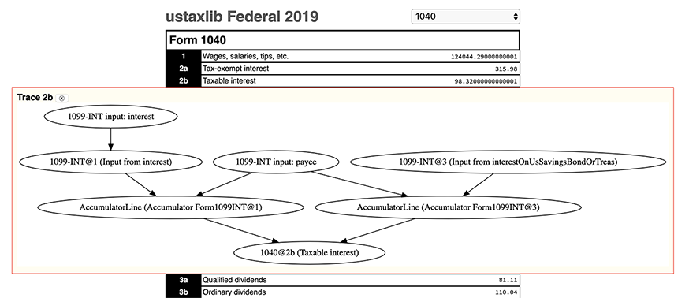

# ustaxviewer

This package provides an HTML frontend to the [ustaxlib] system.

Every Form object that is added to the TaxReturn is viewable, with the value of every line
displayed:

In order to aid debugging the computations, you can click the black line identifier to expand a flow
graph showing the values that went into the computation. That includes the master computation for
the "Amount You Owe", for example, which [yields this massive graph](doc/f1040-amount-owed.svg).

# Usage

See the [ustaxlib] repository for how to get started modeling taxes. To run the viewer, simply do:

    npx ustaxviewer taxfile.ts

Note that `taxfile.ts` should have a default export of the TaxReturn object to be rendered.

[ustaxlib]: https://github.com/rsesek/ustaxlib
